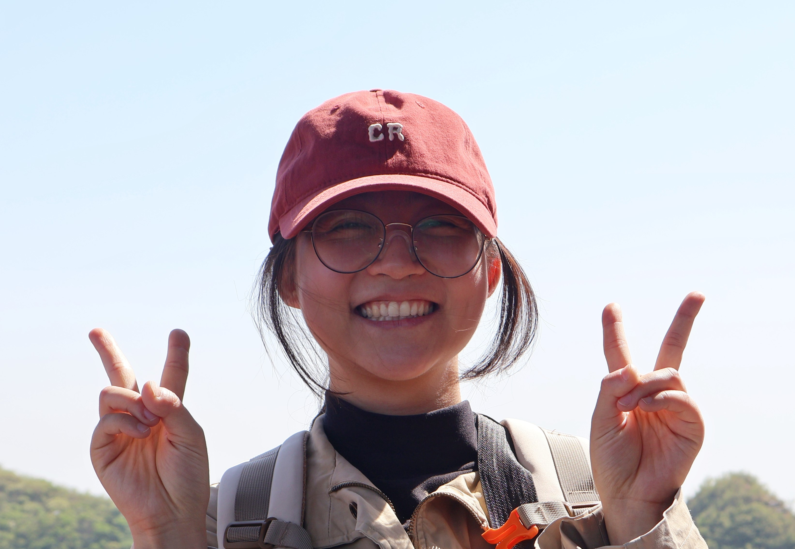

---
I'm a PhD candidate in the Department of Psychological and Cognitive Sciences at **Tsinghua Universsity**, under the mentorship of **Prof. Stella Christie**. I am broadly interested in understanding when and why humans choose to explore. 

**Current Focus:** **explore-exploit decision-making**, **curiosity**, **active learning**. 

---
One central line of my work examines **how metacognitive regulation of one's knowledge state shapes explore–exploit decisions**, aiming to understand how self-regulated learning processes--such as self-assessment and self-monitoring--influence one's explore-exploit preferences. In the other project with Huiwen Alex Yang from UC Berkeley, we study **the differences in explore–exploit decisions between rural and urban children**, highlighting how growing up within distinct childhood support systems shapes exploration preferences. Another project conducted with undergraduate student Ariel Chang is to examine **how different forms of feedback (encouraging vs. reflective) regulate children's explore–exploit decisions**, extending the focus within social context in guiding exploration behavior.

As a short-term visiting scholar in the Kidd Lab at the University of California, Berkeley, I have been working on **how domain expertise influences curiosity and learning**, under the mentorship of Prof. Celeste Kidd. I am deeply grateful for her guidance and the support of the Kidd Lab. This project is ongoing.

* Check out my [[publications]]
* Download my [CV](/CV_Yijin_Fang.pdf)

---
**Earlier Work:**

Before starting my PhD, I worked on a project of **play for learning**, in collaboration with Dr. Jinyun Lyv and under the mentorship of Prof. Stella Christie. Together, we investigated the learning mechanisms and constraints of children's play. In particular, our work focused on **how initial success and failure influence children's learning through play**. We have also studied **caregivers' beliefs toward children's play and learning**, in collaboration with Prof. Kathy Hirsh-Pasek’s team at Temple University. This work has also been extended to applied contexts in Chinese society, with particular contributions to the design of **child-friendly city** that better support children’s play and learning.

